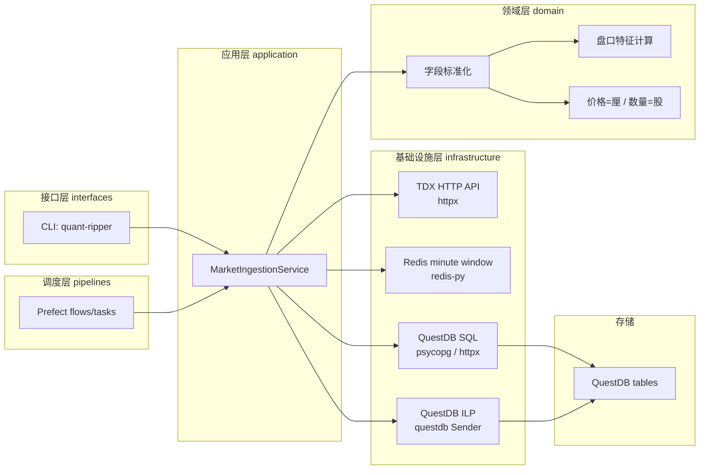
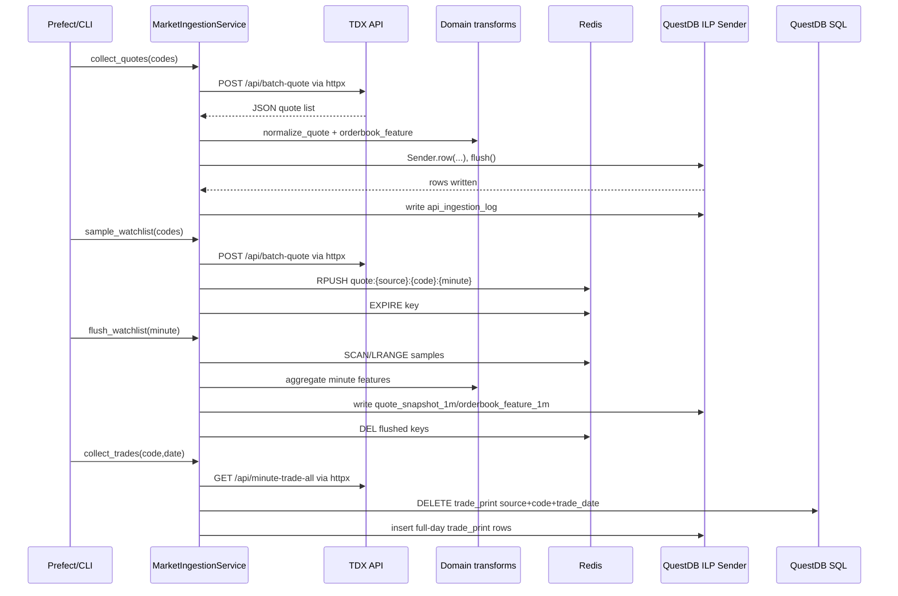

# quant-ripper 架构设计与实现说明

本文档补充 `tdx_api_questdb_design.md` 的工程落地方案，重点描述业务分层、技术选型、数据流、部署边界和维护约定。

## 1. 技术选型

| 能力 | 选型 | 项目落点 | 说明 |
|---|---|---|---|
| HTTP 调用 | `httpx` | `quant_ripper.infrastructure.http_client` | 所有 TDX API 与 QuestDB HTTP `/exec` fallback 都走 `httpx`。 |
| Redis | `redis-py` (`redis`) | `quant_ripper.infrastructure.redis_cache` | 自选池 2 到 3 秒盘口采样写 Redis list，分钟结束聚合后删除 key。 |
| QuestDB 行情写入 | `questdb.ingress.Sender` | `quant_ripper.infrastructure.questdb_ilp` | 使用 QuestDB 官方 Python client 写 ILP；默认 TCP `9009`，配置为 `tcp::addr=<host>:<port>;protocol_version=2;`。 |
| QuestDB SQL | `psycopg[binary]`，fallback `httpx` | `quant_ripper.infrastructure.questdb_client` | DDL、DELETE 覆盖、checkpoint 查询走 PGWire；无法安装 PGWire 时可用 HTTP `/exec`。 |
| 任务调度 | Prefect 3 | `quant_ripper.pipelines.flows` | 流程、重试、部署、补数与定时调度由 Prefect 负责。 |
| 配置 | `.env` + `config/example.env` | `quant_ripper.core.config` | 示例配置提供默认值，生产环境用 `.env` 或进程环境覆盖。 |

参考资料：

- QuestDB Python client 官方文档：<https://questdb.com/docs/ingestion/clients/python/>。项目实现使用 `Sender.from_conf(...)`、`sender.row(...)`、`sender.flush()`；TCP ILP 可使用 `tcp::addr=127.0.0.1:9009;protocol_version=2;`。
- Prefect 官方部署文档：<https://docs.prefect.io/v3/concepts/deployments>、<https://docs.prefect.io/v3/deploy/infrastructure-examples/docker>。项目部署按 deployment + work pool + worker 组织。

## 2. 分层结构

```text
src/quant_ripper/
  core/              配置与项目根路径
  common/            时间、日志等无业务副作用工具
  domain/            行情字段标准化、单位转换、盘口特征计算
  infrastructure/    TDX HTTP、Redis、QuestDB SQL/ILP 等外部系统适配
  application/       采集用例编排：抽取、转换、写入、日志、checkpoint
  pipelines/         Prefect flow/task 定义
  interfaces/        CLI 入口
```

根包目录只保留 `__init__.py` 和业务分层子包；重构前的扁平模块已经删除，不再保留旧 import 兼容层。

## 3. 总体架构图



## 4. 数据写入链路



## 5. 模块职责

| 模块 | 关键对象 | 职责 |
|---|---|---|
| `core.config` | `Settings` | 读取 `.env`、进程环境与默认配置，统一提供连接信息和业务参数。 |
| `common.time_utils` | `parse_datetime`、`minute_key` | 处理 TDX 日期、交易日、分钟桶和 QuestDB 时间。 |
| `common.logging` | `JsonFormatter` | 输出结构化 JSON 日志，便于 Prefect 采集。 |
| `domain.transforms` | `normalize_quote`、`normalize_bar`、`orderbook_feature` | API 原始字段到业务表字段的转换；统一价格单位为厘，数量单位为股。 |
| `infrastructure.http_client` | `HttpJsonClient` | `httpx.Client` 封装，负责超时、重试、JSON 解码和延迟记录。 |
| `infrastructure.tdx_client` | `TdxClient` | TDX API endpoint facade，避免业务层拼 HTTP 路径。 |
| `infrastructure.redis_cache` | `RedisQuoteCache` | 使用 redis-py 操作 watchlist 分钟窗口缓存。 |
| `infrastructure.questdb_client` | `QuestSqlClient` | DDL、DELETE、SQL 查询；PGWire 优先，HTTP `/exec` 兜底。 |
| `infrastructure.questdb_ilp` | `QuestDbIlpWriter` | 用 QuestDB 官方 client 批量写入行情事实表。 |
| `application.ingestion_service` | `MarketIngestionService` | 采集用例编排、日志、checkpoint、幂等覆盖写入。 |
| `pipelines.flows` | Prefect flow/task | 生产调度、重试、补数入口。 |
| `interfaces.cli` | `main` | 本地命令行和运维脚本入口。 |

## 6. 方法注释约定

- 应用层、领域层、基础设施层的类和方法均添加 docstring，说明“做什么”和关键业务约束。
- 字段级解释仍以 `docs/tdx_api_questdb_design.md` 和 `sql/questdb_schema.sql` 为准。
- 复杂业务规则优先写在 `domain.transforms` 的函数 docstring 与设计文档中；代码内只保留必要的短注释。

## 7. QuestDB 写入约定

- 行情事实表写入统一走 `QuestDbIlpWriter`，该类内部调用 `questdb.ingress.Sender.from_conf()`。
- `TIMESTAMP_COLUMNS` 定义每张表的 designated timestamp；`SYMBOL_COLUMNS` 定义 QuestDB symbol 字段。
- `trade_print` 不启用 dedup，按交易日或分钟桶先 `DELETE` 再整批写入。
- DDL 与 DELETE 通过 `QuestSqlClient` 执行，优先 PGWire，fallback 为 `httpx` 调用 QuestDB `/exec`。

## 8. Redis 缓存约定

- key 格式：`quote:{source}:{code}:{yyyyMMddHHmm}`。
- value 为标准化后的 quote JSON，时间字段用 ISO 字符串存储，flush 时恢复为 `datetime`。
- 每次 `sample_watchlist` 后设置 TTL，默认 `172800` 秒。
- `flush_watchlist` 成功写入 QuestDB 后默认删除已聚合 key；使用 CLI 的 `--keep-keys` 可保留。

## 9. Prefect 流程边界

| Flow | 用途 |
|---|---|
| `tdx-pre-market` | 初始化 schema，刷新股票/ETF 主数据。 |
| `tdx-quotes-once` | 执行一次全市场或批量代码 1 分钟盘口采集。 |
| `tdx-watchlist-sample` | 高频采样自选池并写入 Redis。 |
| `tdx-watchlist-flush` | 聚合 Redis 自选池样本并写 QuestDB。 |
| `tdx-kline-backfill` | 历史 K 线补数。 |
| `tdx-minute-backfill` | 分时走势补数。 |
| `tdx-trade-backfill` | 成交明细按日覆盖补数。 |

## 10. 虚拟环境与依赖策略

- 本地开发建议保留 `.venv`，避免 Prefect、QuestDB client、redis-py 与系统 Python 混装。
- 生产部署如果用 Process worker，也建议每个项目一个虚拟环境，并通过 `pip install -e .[prefect]` 安装。
- 生产部署如果用 Docker worker，容器镜像就是隔离环境，不需要在宿主机为运行时创建 `.venv`，但构建机仍可使用 `.venv` 做测试。
- 依赖入口：
  - `requirements.txt`：运行时基础依赖。
  - `requirements-prefect.txt`：Prefect worker/flow 运行依赖。
  - `requirements-dev.txt`：本地测试依赖。
  - `pyproject.toml`：Python 包元数据和 `quant-ripper` 命令入口。
