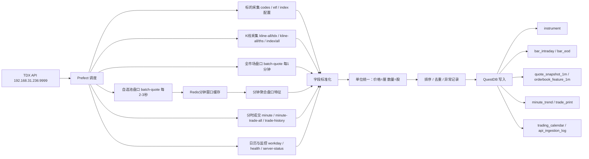

# 通达信 API 至 QuestDB 数据落标设计文档

版本：v4  
接入层地址：`http://192.168.31.236:9999`  
目标存储：QuestDB  
调度框架：Prefect  
Redis：`192.168.31.99:6379`，使用 DB `9`  
QuestDB：Docker 部署，HTTP Console `9005`，PostgreSQL Wire `8812`，ILP TCP `9009`，Health `9003`  

## 1. 需求背景

当前已有一套通达信行情 API 服务，能够提供股票、ETF、指数、K 线、分时走势、成交明细、五档盘口、交易日历和服务状态等数据。团队希望把这些接口能力沉淀为可长期复用的数据资产，用于量化研究、盘中监控、特征工程、回测和后续多源行情接入。

这套方案不把通达信当成唯一数据源绑定在表结构里。表名和字段表达通用金融行情语义，数据来源通过 `source` 字段区分。通达信来源统一写为 `tdx`，后续可以扩展 `ths`、`exchange`、`broker`、`akshare` 等来源。

## 2. 建设目标

- 沉淀股票、ETF、指数三类标的。
- 支持日线、周线、月线、季线、年线、1 分钟、5 分钟、15 分钟、30 分钟、小时线。
- 支持分时走势、成交明细、1 分钟盘口快照、1 分钟盘口特征。
- 支持原始不复权和前复权 K 线并存，通过 `adjustment` 严格区分。
- 全市场盘口默认按 1 分钟落库，避免秒级全量盘口造成不必要的存储压力。
- 自选池可以 2 到 3 秒采样，用 Redis 做分钟内聚合，再写入 QuestDB。
- 所有价格和成交额字段统一单位为“厘”，即 `1 元 = 1000 厘`。
- 所有成交量、挂单量字段统一单位为“股”。
- 使用 Prefect 做任务编排、限流、重试、补数、幂等写入。
- 使用 checkpoint 表记录断点，支持失败重试和稳定补数。
- 对金额字段做抽样一致性校验，避免 API 金额单位理解错误。

## 2.1 部署与连接信息

### 通达信 API

- Base URL：`http://192.168.31.236:9999`
- 协议：HTTP JSON
- 用途：行情、K 线、分时、成交、标的池、交易日历和服务状态采集。

### Redis

- Host：`192.168.31.99`
- Port：`6379`
- DB：`9`
- 用途：自选池 2 到 3 秒盘口采样的分钟窗口缓存。
- Key 建议：`quote:{source}:{code}:{yyyyMMddHHmm}`，例如 `quote:tdx:000001:202605260931`。
- TTL 建议：盘中临时缓存 1 到 2 个交易日；聚合成功写入 QuestDB 后可删除对应分钟 key。

### QuestDB

Docker Compose 暴露端口：

| 用途 | 容器端口 | 主机端口 | 连接方式 |
|---|---:|---:|---|
| Web Console | 9000 | 9005 | `http://<questdb-host>:9005` |
| PostgreSQL Wire | 8812 | 8812 | `postgresql://admin:quest@<questdb-host>:8812/qdb`，以实际账号为准 |
| ILP TCP | 9009 | 9009 | `tcp://<questdb-host>:9009` |
| Health Check | 9003 | 9003 | `http://<questdb-host>:9003` |

写入建议：

- 高频行情和批量事实表写入优先使用 ILP TCP `9009`。
- DDL、删除覆盖、校验查询和 checkpoint 查询使用 PostgreSQL Wire `8812`。
- `trade_print` 采用删除后覆盖写入，需要通过 PostgreSQL Wire 先执行 `DELETE`，再用 ILP 或批量 SQL 插入。

## 3. 关键问题回答

### 3.1 `source_endpoint` 是否需要

业务事实表里不需要 `source_endpoint`。字段保留为：

- `source`：短来源名，例如 `tdx`、`ths`、`exchange`。
- `adjustment`：复权状态，例如 `raw`、`qfq`、`unknown`。

原因：

- 同一张事实表的查询通常关心数据来自哪个系统，而不是来自哪个 HTTP 路径。
- API 路径属于采集实现细节，不应污染业务事实表。
- 如果接口重构，事实表无需迁移。

但采集日志表 `api_ingestion_log` 需要保留 `endpoint`，用于排障、统计接口延迟和定位失败来源。

### 3.2 五档盘口字段是什么意思

`quote_snapshot_1m` 中的五档字段来自 `/api/quote` 或 `/api/batch-quote` 的 `BuyLevel` 和 `SellLevel`。

买盘字段：

- `bid1_price`：买一价，当前最高买入挂单价格，单位为厘。
- `bid1_qty`：买一挂单量，单位为股。
- `bid2_price`：买二价，次高买入挂单价格，单位为厘。
- `bid2_qty`：买二挂单量，单位为股。
- `bid3_price`、`bid3_qty`：买三价格与挂单量。
- `bid4_price`、`bid4_qty`：买四价格与挂单量。
- `bid5_price`、`bid5_qty`：买五价格与挂单量。

卖盘字段：

- `ask1_price`：卖一价，当前最低卖出挂单价格，单位为厘。
- `ask1_qty`：卖一挂单量，单位为股。
- `ask2_price`：卖二价，次低卖出挂单价格，单位为厘。
- `ask2_qty`：卖二挂单量，单位为股。
- `ask3_price`、`ask3_qty`：卖三价格与挂单量。
- `ask4_price`、`ask4_qty`：卖四价格与挂单量。
- `ask5_price`、`ask5_qty`：卖五价格与挂单量。

这些字段用于计算盘口价差、买卖深度、订单簿不均衡、短期买卖压力等日内特征。

### 3.3 是否需要 2 到 3 秒查自选池盘口，用 Redis 聚合 1 分钟盘口

建议需要，但只用于自选池或重点监控池，不用于全市场默认链路。

推荐分层：

- 全市场：每 1 分钟调用 `/api/batch-quote`，直接写 `quote_snapshot_1m` 和 `orderbook_feature_1m`。
- 自选池：每 2 到 3 秒调用 `/api/batch-quote`，写 Redis 短窗口缓存。
- 每分钟结束时，从 Redis 聚合自选池盘口，生成 1 分钟特征，再写 QuestDB。

Redis 聚合建议：

- key：`quote:{code}:{yyyyMMddHHmm}`
- 保存该分钟内多个盘口样本。
- 每分钟聚合出：
  - 最后一笔盘口快照：作为该分钟 `quote_snapshot_1m`。
  - 平均 spread。
  - 最大 spread。
  - 平均 bid/ask depth。
  - 平均盘口不均衡。
  - 最大盘口不均衡。
  - 最后一笔盘口不均衡。
  - 分钟内第一笔和最后一笔最新价。
  - 最后一笔 active buy ratio。
  - 样本数 `sample_count`。
  - 有效盘口样本数 `quote_count`。

这样既保留分钟级研究可用性，也避免秒级明细长期写入 QuestDB 带来过高成本。

### 3.4 `bar_intraday` 和 `bar_eod` 是什么意思，为什么分表

`bar` 是金融数据里常用的 K 线或柱状行情数据命名。

- `bar_intraday`：日内 K 线，包含 `minute1`、`minute5`、`minute15`、`minute30`、`hour`。
- `bar_eod`：日终及以上 K 线，包含 `day`、`week`、`month`、`quarter`、`year`。EOD 是 End Of Day 的缩写。

分表好处：

- 数据量差异大：分钟线数据量远大于日线、周线、月线。
- 分区策略不同：分钟线长期全市场落库建议按月分区，日线及以上适合按年分区。
- 查询模式不同：日内研究按交易日窗口查询，回测研究按多年历史查询。
- 写入频率不同：分钟线盘中持续写入，日线及以上多在收盘后写入。
- 复权逻辑不同：分钟线通常 `raw`，日/周/月需要同时保存 `raw` 和 `qfq`。

不建议把所有 K 线混在一张表，也不建议每个周期单独一张表。两张表是性能、维护成本和查询体验之间的折中。`bar_intraday` 默认使用 `PARTITION BY MONTH`，避免全市场多年 1 分钟数据产生过多日分区；如果部署目标只保存短周期或强依赖单日整批删除，可再改为日分区。

### 3.5 `minute_trend` 和分钟 K 线区别是什么

`minute_trend` 来自 `/api/minute`，是分时走势数据；分钟 K 线来自 `/api/kline` 或 `/api/kline-all/tdx` 的 `minute1`。

区别如下：

| 对比项 | `minute_trend` | `bar_intraday` 的 `minute1` |
|---|---|---|
| 来源接口 | `/api/minute` | `/api/kline?type=minute1` 或 `/api/kline-all/tdx?type=minute1` |
| 数据含义 | 分时走势点 | 标准 1 分钟 K 线 |
| 字段 | `Time/Price/Number` | `Open/High/Low/Close/Volume/Amount` |
| 价格 | 该分钟分时价格 | 该分钟 OHLC |
| 成交量 | 该分钟成交量 | 该分钟 K 线成交量 |
| 适用场景 | 分时图、VWAP、盘中走势回放 | 技术指标、分钟级回测、因子计算 |

两者都要落。`minute_trend` 更像分时图数据，`bar_intraday` 更适合标准 K 线研究。

### 3.6 `trade_print` 为什么不使用去重键

实测 `GET /api/minute-trade-all?code=000001` 返回字段只有 `Time/Price/Volume/Status/Number`，没有天然 `row_no/trade_no/seq_no`。`Time` 精度是分钟，例如 `2026-05-26T09:30:00+08:00` 下会有很多条成交记录；并且完整组合 `Time + Price + Volume + Status + Number` 也会重复。

因此这个接口不是严格意义上的逐笔成交，而是“分钟时间戳下的分时成交明细”。若使用 `ts + code + price + volume + side + source` 去重，同一分钟内多笔相同价格、数量、方向的成交会被误合并。

修正口径：

- `trade_print` 不使用 `DEDUP UPSERT KEYS`，允许同一分钟内完全相同的多条成交明细同时存在。
- 盘中更新某一分钟成交时，先删除该 `source + code + trade_date + ts` 对应的分钟桶，再插入接口返回的该分钟所有明细。
- 收盘后或历史补数时，优先使用 `/api/minute-trade-all` 拉全日数据；先删除该 `source + code + trade_date` 的全日成交，再插入完整列表。
- `/api/trade` 只返回最近窗口，适合盘中预览和临时监控；若用于盘中刷新，只替换响应中涉及到的分钟桶。
- 删除和插入之间如果失败，checkpoint 保持未成功状态，Prefect 下一轮必须重跑对应分钟桶或交易日。

如果未来 API 增加 `trade_no` 或 `seq_no`，再新增该字段并启用基于原生编号的去重键。在当前接口形态下，删除后覆盖比伪造 `row_no` 更符合数据语义。

### 3.7 `instrument` 是否会覆盖历史名称和状态

`instrument` 表定位为当前主数据快照，适合快速查询当前股票池、ETF 池和指数池。为避免丢失改名、退市、状态变化历史，新增 `instrument_daily_snapshot`。

字段补充：

- `listed_date`：上市日期，接口没有时为空。
- `delisted_date`：退市日期，接口没有时为空。
- `status`：`listed/suspended/delisted/unknown`。

每日盘前主数据任务同时写：

- `instrument`：当前可用主数据。
- `instrument_daily_snapshot`：当天主数据快照，用于追踪历史名称和状态。

### 3.8 盘口表为什么补 `trade_date`

`quote_snapshot_1m` 原本只有 `ts`，能表达时间，但实际运维中经常需要按交易日补数、删除、校验和回放。补充 `trade_date` 后：

- 可以快速定位某个交易日的盘口完整性。
- 可以按交易日重跑某批数据。
- 与 `minute_trend`、`trade_print` 的日期字段保持一致。

### 3.9 API 回退描述冲突怎么处理

文档中 `/api/kline` 和 `/api/minute` 同时出现“失败不回退”和“自动回退”的描述，这是采集层必须规避的歧义。

生产采集规则：

- 原始 K 线主链路不依赖 `/api/kline` 判断来源，优先使用显式 `/api/kline-all/tdx`。
- 前复权日/周/月主链路优先使用显式 `/api/kline-all/ths`。
- `/api/kline` 仅作为盘中增量和小范围补充，写入时 `adjustment=unknown`，除非接口路径已能确定来源。
- `/api/minute` 写入时同时保存请求日期 `trade_date` 和返回日期 `actual_date`。
- 若 `actual_date != trade_date`，写事实表时保留真实 `actual_date`，同时在 `api_ingestion_log` 记录 `fallback_detected`。

### 3.10 为什么增加 `adjust_factor`

仅保存 `raw/qfq` 的价格结果可以支持查询，但不足以复现前复权历史。一旦第三方前复权规则变化，历史结果可能漂移。

新增 `adjust_factor` 保存：

- `code`
- `ex_date`
- `factor`
- `source`
- `updated_at`

当前 API 文档没有直接提供复权因子接口，因此 `adjust_factor` 在首版中作为可扩展表：有可靠因子来源时写入，不从价格差异里强行反推。

### 3.11 `amount` 单位如何确认

文档声明成交额单位为“厘”，但金额最容易出现接口实现与文档不一致。采集层必须做抽样校验：

- 对 K 线：校验 `amount` 与 `close_price * volume` 的数量级是否合理。
- 对盘口：校验当日累计 `amount` 与 `last_price * total_volume` 的数量级是否合理。
- 允许误差，因为金额是成交逐笔累加，不能简单等于最新价乘累计量。
- 如果数量级偏差超过配置阈值，写 `api_ingestion_log.status=amount_check_failed`，不自动改单位。

### 3.12 为什么需要 checkpoint 表

`api_ingestion_log` 是日志，不适合作为断点状态。Prefect 补数和重试需要稳定查询“某个代码、周期、复权状态上次成功到哪里”。

新增 `ingestion_checkpoint`，记录：

- `source`
- `endpoint`
- `code`
- `asset_type`
- `data_type`
- `bar_type`
- `adjustment`
- `last_success_ts`
- `last_success_trade_date`
- `status`

这张表用于断点续跑、失败重试、增量拉取和运维巡检。

### 3.13 QuestDB DEDUP 键约束

QuestDB 的 `DEDUP UPSERT KEYS` 必须包含 designated timestamp。所有建表语句均按该约束修正，例如：

- `quote_snapshot_1m`：`DEDUP UPSERT KEYS(ts, code, source)`
- `trade_print`：不启用 `DEDUP`；采用分钟桶或交易日桶 `DELETE + INSERT` 覆盖。
- `ingestion_checkpoint`：`DEDUP UPSERT KEYS(ts, source, endpoint, code, data_type, bar_type, adjustment)`

## 4. API 能力清单与使用方式

| # | API | 入参 | 主要出参 | 使用方式 |
|---|---|---|---|---|
| 1 | `GET /api/quote` | `code`，支持逗号多代码 | 五档盘口、最新价、成交量额、内外盘 | 少量标的实时查询；主链路优先用批量接口 |
| 2 | `GET /api/kline` | `code,type` | `List[].Time/Open/High/Low/Close/Volume/Amount` | 增量 K 线补充；日/周/月可能为前复权 |
| 3 | `GET /api/minute` | `code,date?` | `date, Count, List[].Time/Price/Number` | 写入 `minute_trend` |
| 4 | `GET /api/trade` | `code,date?` | `List[].Time/Price/Volume/Status/Number` | 最近窗口成交明细；盘中预览，不作为主去重来源 |
| 5 | `GET /api/search` | `keyword` | `code,name` | 人工搜索，不作为批量入库主源 |
| 6 | `GET /api/stock-info` | `code` | `quote,kline_day,minute` | 联调和抽样校验，不作为主采集源 |
| 7 | `GET /api/codes` | `exchange?` | `total, exchanges, codes[].code/name/exchange` | 股票主数据主来源 |
| 8 | `POST /api/batch-quote` | JSON: `codes[]` | 多标的 quote 数组 | 全市场 1 分钟盘口采集主接口 |
| 9 | `GET /api/kline-history` | `code,type,start_date?,end_date?,limit?` | 指定范围 K 线 | 小窗口修补历史 K 线 |
| 10 | `GET /api/index` | `code,type?` | 指数 K 线 | 指数增量 K 线 |
| 11 | `GET /api/market-stats` | 无明确文档细节 | 市场统计 | 监控类，按实际响应保留 |
| 12 | `GET /api/server-status` | 无 | `status,connected,version,uptime` | API 健康监控 |
| 13 | `GET /api/health` | 无 | `status,time` | API 健康监控 |
| 14 | `POST /api/tasks/pull-kline` | `codes?,tables?,dir?,limit?,start_date?` | `task_id` | API 自带任务，不作为主落库链路 |
| 15 | `POST /api/tasks/pull-trade` | `code,dir?,start_year?,end_year?` | `task_id` | 离线兜底，不作为主落库链路 |
| 16 | `GET /api/tasks` | 无 | 任务列表 | 运维监控 |
| 17 | `GET /api/tasks/{id}` | `task_id` | `id,type,status,started_at,error?` | 运维监控 |
| 18 | `POST /api/tasks/{id}/cancel` | `task_id` | 取消结果 | 操作审计，不入行情事实表 |
| 19 | `GET /api/etf` | `exchange?,limit?` | `list[].code/name/exchange/last_price` | ETF 主数据主来源 |
| 20 | `GET /api/trade-history` | `code,date,start?,count?` | 分页历史成交 | 历史成交补数 |
| 21 | `GET /api/minute-trade-all` | `code,date?` | 全天成交明细，分钟级时间戳 | 单日 `trade_print` 主采集接口；按交易日桶覆盖写入 |
| 22 | `GET /api/workday` | `date?,count?` | `date,is_workday,next,previous` | 单日交易日校验 |
| 23 | `GET /api/market-count` | 无 | `total,exchanges[].exchange/count` | 标的池数量监控 |
| 24 | `GET /api/stock-codes` | `limit?,prefix?` | `list[]` | 股票代码交叉校验 |
| 25 | `GET /api/etf-codes` | `limit?,prefix?` | `list[]` | ETF 代码交叉校验 |
| 26 | `GET /api/kline-all` | `code,type?,limit?` | 全量 K 线 | 普通全量接口；需记录来源不确定性 |
| 27 | `GET /api/index/all` | `code,type?,limit?` | 指数全量 K 线 | 指数历史主来源 |
| 28 | `GET /api/trade-history/full` | `code,before?,limit?` | 上市以来成交 | 深度历史补数，需限流 |
| 29 | `GET /api/workday/range` | `start,end` | 交易日列表 | 交易日历主来源 |
| 30 | `GET /api/income` | `code,start_date,days?` | `offset,time,rise,rise_rate,source,current` | 派生收益校验，不作为原始行情源 |
| 31 | `GET /api/kline-all/tdx` | `code,type?,limit?` | 通达信原始全量 K 线 | 原始不复权 K 线主来源 |
| 32 | `GET /api/kline-all/ths` | `code,type?,limit?` | 同花顺前复权日/周/月 | 前复权 K 线主来源 |

## 5. API 使用策略

### 5.1 标的池

- 股票：每日盘前调用 `/api/codes`，写入 `instrument`。
- ETF：每日盘前调用 `/api/etf`，写入 `instrument`。
- 指数：用配置维护常用指数，例如 `sh000001`、`sz399001`、`sz399006`、`sh000300`，通过 `/api/index/all` 拉取历史 K 线。
- `/api/stock-codes`、`/api/etf-codes` 用于和主数据交叉校验，不作为主表唯一来源。

### 5.2 K 线

- 原始 K 线优先使用 `/api/kline-all/tdx`，`source=tdx`，`adjustment=raw`。
- 前复权日/周/月优先使用 `/api/kline-all/ths`，`source=ths`，`adjustment=qfq`。
- 指数 K 线使用 `/api/index/all`，`source=tdx`，`asset_type=index`。
- 小范围缺口用 `/api/kline-history` 修补。
- 盘中增量可使用 `/api/kline`。

### 5.3 盘口

- 全市场默认每 1 分钟调用 `/api/batch-quote`。
- 原始快照写入 `quote_snapshot_1m`。
- 同步计算盘口特征写入 `orderbook_feature_1m`。
- 自选池可每 2 到 3 秒采样，先进入 Redis，分钟结束后聚合为 1 分钟快照和特征。

### 5.4 分时和成交

- `/api/minute` 写入 `minute_trend`。
- `/api/minute-trade-all` 写入当日 `trade_print`，采用 `DELETE source+code+trade_date` 后整日重插。
- `/api/trade` 返回最近窗口，不适合作为全量成交主采集源；仅用于盘中监控或接口联调。
- `/api/trade-history` 用于分页补历史成交。
- `/api/trade-history/full` 用于深度历史补数，必须控制并发和响应大小。

### 5.5 收益区间

- `/api/income` 是派生分析接口，不作为原始行情主来源。
- 可用于快速验证信号收益。
- 可用于抽样校验基于 `bar_eod` 自算的未来 N 日收益标签。

## 6. QuestDB 表设计

QuestDB 不依赖数据库内字段注释能力，字段解释以本文档和 SQL 行内注释共同维护。

### 6.1 `instrument` 标的表

```sql
CREATE TABLE IF NOT EXISTS instrument (
  ts TIMESTAMP,          -- 采集时间；当前主数据刷新时间
  code SYMBOL,           -- 证券代码
  exchange SYMBOL,       -- sh/sz/bj/unknown
  asset_type SYMBOL,     -- stock/etf/index
  name STRING,           -- 当前证券名称
  listed_date SYMBOL,    -- 上市日期 YYYYMMDD；接口无则为空
  delisted_date SYMBOL,  -- 退市日期 YYYYMMDD；接口无则为空
  status SYMBOL,         -- listed/suspended/delisted/unknown
  last_price LONG,       -- ETF接口价格；单位：厘
  source SYMBOL          -- 数据来源：tdx/ths/manual
) TIMESTAMP(ts) PARTITION BY MONTH WAL
DEDUP UPSERT KEYS(ts, code, asset_type, source);
```

### 6.1.1 `instrument_daily_snapshot` 标的日快照

```sql
CREATE TABLE IF NOT EXISTS instrument_daily_snapshot (
  ts TIMESTAMP,          -- 快照日期 00:00:00
  trade_date SYMBOL,     -- 快照日期 YYYYMMDD
  code SYMBOL,           -- 证券代码
  exchange SYMBOL,       -- sh/sz/bj/unknown
  asset_type SYMBOL,     -- stock/etf/index
  name STRING,           -- 当日证券名称
  listed_date SYMBOL,    -- 上市日期 YYYYMMDD；接口无则为空
  delisted_date SYMBOL,  -- 退市日期 YYYYMMDD；接口无则为空
  status SYMBOL,         -- listed/suspended/delisted/unknown
  last_price LONG,       -- ETF接口价格；单位：厘
  source SYMBOL          -- 数据来源：tdx/ths/manual
) TIMESTAMP(ts) PARTITION BY MONTH WAL
DEDUP UPSERT KEYS(ts, code, asset_type, source);
```

### 6.2 `trading_calendar` 交易日历

```sql
CREATE TABLE IF NOT EXISTS trading_calendar (
  ts TIMESTAMP,          -- 日期 00:00:00
  date_numeric SYMBOL,   -- YYYYMMDD
  is_trading_day BOOLEAN,-- 是否交易日
  source SYMBOL          -- 数据来源：tdx
) TIMESTAMP(ts) PARTITION BY YEAR WAL
DEDUP UPSERT KEYS(ts, date_numeric, source);
```

### 6.3 `quote_snapshot_1m` 一分钟盘口快照

```sql
CREATE TABLE IF NOT EXISTS quote_snapshot_1m (
  ts TIMESTAMP,          -- 分钟采样时间，例如 09:31:00
  trade_date SYMBOL,     -- 交易日期 YYYYMMDD，便于补数、删除和校验
  collected_at TIMESTAMP,-- 实际采集时间
  server_ts TIMESTAMP,   -- API服务时间
  code SYMBOL,           -- 证券代码
  exchange SYMBOL,       -- sh/sz/bj/unknown
  asset_type SYMBOL,     -- stock/etf/index
  prev_close LONG,       -- 昨收价；单位：厘
  open_price LONG,       -- 开盘价；单位：厘
  high_price LONG,       -- 当日最高价；单位：厘
  low_price LONG,        -- 当日最低价；单位：厘
  last_price LONG,       -- 最新价；单位：厘
  total_volume LONG,     -- 当日累计成交量；单位：股
  current_volume LONG,   -- 当前现量；单位：股
  amount LONG,           -- 当日累计成交额；单位：厘
  inside_volume LONG,    -- 内盘；单位：股
  outside_volume LONG,   -- 外盘；单位：股
  rate DOUBLE,           -- API返回的Rate字段
  bid1_price LONG,       -- 买一价；单位：厘
  bid1_qty LONG,         -- 买一挂单量；单位：股
  bid2_price LONG,       -- 买二价；单位：厘
  bid2_qty LONG,         -- 买二挂单量；单位：股
  bid3_price LONG,       -- 买三价；单位：厘
  bid3_qty LONG,         -- 买三挂单量；单位：股
  bid4_price LONG,       -- 买四价；单位：厘
  bid4_qty LONG,         -- 买四挂单量；单位：股
  bid5_price LONG,       -- 买五价；单位：厘
  bid5_qty LONG,         -- 买五挂单量；单位：股
  ask1_price LONG,       -- 卖一价；单位：厘
  ask1_qty LONG,         -- 卖一挂单量；单位：股
  ask2_price LONG,       -- 卖二价；单位：厘
  ask2_qty LONG,         -- 卖二挂单量；单位：股
  ask3_price LONG,       -- 卖三价；单位：厘
  ask3_qty LONG,         -- 卖三挂单量；单位：股
  ask4_price LONG,       -- 卖四价；单位：厘
  ask4_qty LONG,         -- 卖四挂单量；单位：股
  ask5_price LONG,       -- 卖五价；单位：厘
  ask5_qty LONG,         -- 卖五挂单量；单位：股
  source SYMBOL          -- 数据来源：tdx
) TIMESTAMP(ts) PARTITION BY DAY WAL
DEDUP UPSERT KEYS(ts, code, source);
```

### 6.4 `orderbook_feature_1m` 一分钟盘口特征

```sql
CREATE TABLE IF NOT EXISTS orderbook_feature_1m (
  ts TIMESTAMP,              -- 分钟采样时间
  trade_date SYMBOL,         -- 交易日期 YYYYMMDD
  code SYMBOL,               -- 证券代码
  asset_type SYMBOL,         -- stock/etf/index
  first_last_price LONG,     -- 分钟内第一笔最新价；单位：厘
  last_last_price LONG,      -- 分钟内最后一笔最新价；单位：厘
  last_price LONG,           -- 兼容字段，等同 last_last_price；单位：厘
  spread LONG,               -- 最后一笔 ask1_price - bid1_price；单位：厘
  avg_spread DOUBLE,         -- 分钟内平均价差；单位：厘
  max_spread LONG,           -- 分钟内最大价差；单位：厘
  mid_price LONG,            -- 最后一笔 (ask1_price + bid1_price) / 2；单位：厘
  bid_depth_5 LONG,          -- 最后一笔买五档总挂单量；单位：股
  ask_depth_5 LONG,          -- 最后一笔卖五档总挂单量；单位：股
  depth_imbalance DOUBLE,    -- 最后一笔盘口不均衡
  avg_depth_imbalance DOUBLE,-- 分钟内平均盘口不均衡
  max_depth_imbalance DOUBLE,-- 分钟内最大盘口不均衡
  last_depth_imbalance DOUBLE,-- 分钟内最后一笔盘口不均衡
  active_buy_ratio DOUBLE,   -- outside_volume / (inside_volume + outside_volume)
  order_pressure DOUBLE,     -- (outside_volume - inside_volume) / (inside_volume + outside_volume)
  sample_count INT,          -- Redis聚合样本数；直接1分钟采样时为1
  quote_count INT,           -- 分钟内有效盘口样本数；通常等同 sample_count
  source SYMBOL              -- 数据来源：tdx
) TIMESTAMP(ts) PARTITION BY DAY WAL
DEDUP UPSERT KEYS(ts, code, source);
```

### 6.5 `bar_intraday` 日内 K 线

```sql
CREATE TABLE IF NOT EXISTS bar_intraday (
  ts TIMESTAMP,          -- K线开始时间
  trade_date SYMBOL,     -- 交易日期 YYYYMMDD
  code SYMBOL,           -- 证券代码
  asset_type SYMBOL,     -- stock/etf/index
  bar_type SYMBOL,       -- minute1/minute5/minute15/minute30/hour
  adjustment SYMBOL,     -- raw
  open_price LONG,       -- 开盘价；单位：厘
  high_price LONG,       -- 最高价；单位：厘
  low_price LONG,        -- 最低价；单位：厘
  close_price LONG,      -- 收盘价；单位：厘
  prev_close LONG,       -- 昨收或上一周期收盘；单位：厘
  volume LONG,           -- 成交量；单位：股
  amount LONG,           -- 成交额；单位：厘
  source SYMBOL          -- 数据来源：tdx
) TIMESTAMP(ts) PARTITION BY MONTH WAL
DEDUP UPSERT KEYS(ts, code, bar_type, adjustment, source);
```

### 6.6 `bar_eod` 日线及以上 K 线

```sql
CREATE TABLE IF NOT EXISTS bar_eod (
  ts TIMESTAMP,          -- K线日期或周期结束日期
  code SYMBOL,           -- 证券代码
  asset_type SYMBOL,     -- stock/etf/index
  bar_type SYMBOL,       -- day/week/month/quarter/year
  adjustment SYMBOL,     -- raw/qfq/unknown
  open_price LONG,       -- 开盘价；单位：厘
  high_price LONG,       -- 最高价；单位：厘
  low_price LONG,        -- 最低价；单位：厘
  close_price LONG,      -- 收盘价；单位：厘
  prev_close LONG,       -- 昨收或上一周期收盘；单位：厘
  volume LONG,           -- 成交量；单位：股
  amount LONG,           -- 成交额；单位：厘
  up_count INT,          -- 上涨家数；指数有效
  down_count INT,        -- 下跌家数；指数有效
  source SYMBOL          -- 数据来源：tdx/ths
) TIMESTAMP(ts) PARTITION BY YEAR WAL
DEDUP UPSERT KEYS(ts, code, bar_type, adjustment, source);
```

### 6.6.1 `adjust_factor` 复权因子表

```sql
CREATE TABLE IF NOT EXISTS adjust_factor (
  updated_at TIMESTAMP,  -- 因子记录更新时间
  code SYMBOL,           -- 证券代码
  ex_date SYMBOL,        -- 除权除息日期 YYYYMMDD
  factor DOUBLE,         -- 复权因子
  source SYMBOL          -- 因子来源：ths/manual/vendor
) TIMESTAMP(updated_at) PARTITION BY YEAR WAL
DEDUP UPSERT KEYS(updated_at, code, ex_date, source);
```

### 6.7 `minute_trend` 分时走势

```sql
CREATE TABLE IF NOT EXISTS minute_trend (
  ts TIMESTAMP,          -- trade_date + Time
  trade_date SYMBOL,     -- 请求日期 YYYYMMDD
  actual_date SYMBOL,    -- API返回的实际数据日期
  code SYMBOL,           -- 证券代码
  asset_type SYMBOL,     -- stock/etf/index
  price LONG,            -- 分时价格；单位：厘
  volume LONG,           -- 分钟成交量；单位：股
  source SYMBOL          -- 数据来源：tdx
) TIMESTAMP(ts) PARTITION BY DAY WAL
DEDUP UPSERT KEYS(ts, code, source);
```

### 6.8 `trade_print` 成交明细

```sql
CREATE TABLE IF NOT EXISTS trade_print (
  ts TIMESTAMP,          -- 成交时间
  trade_date SYMBOL,     -- 交易日期 YYYYMMDD
  code SYMBOL,           -- 证券代码
  asset_type SYMBOL,     -- stock/etf/index
  price LONG,            -- 成交价；单位：厘
  volume LONG,           -- 成交量；单位：股
  side INT,              -- 0主动买入/1主动卖出/2中性
  trade_count INT,       -- 成交单数；接口无该字段时为空
  source SYMBOL          -- 数据来源：tdx
) TIMESTAMP(ts) PARTITION BY DAY WAL;
```

### 6.9 `api_ingestion_log` 采集日志

```sql
CREATE TABLE IF NOT EXISTS api_ingestion_log (
  ts TIMESTAMP,          -- 日志时间
  source SYMBOL,         -- 数据来源：tdx/ths
  endpoint SYMBOL,       -- 实际接口路径，仅日志保留
  request_key STRING,    -- code/date/type/batch等请求标识
  status SYMBOL,         -- success/failed/empty/retry/fallback_detected/amount_check_failed
  latency_ms LONG,       -- 请求耗时
  row_count LONG,        -- 解析出的数据行数
  error_message STRING   -- 失败原因
) TIMESTAMP(ts) PARTITION BY MONTH WAL;
```

### 6.10 `ingestion_checkpoint` 采集断点表

```sql
CREATE TABLE IF NOT EXISTS ingestion_checkpoint (
  ts TIMESTAMP,                  -- checkpoint更新时间
  source SYMBOL,                 -- 数据来源：tdx/ths
  endpoint SYMBOL,               -- 实际接口路径
  code SYMBOL,                   -- 证券代码；全市场任务可为空
  asset_type SYMBOL,             -- stock/etf/index
  data_type SYMBOL,              -- instrument/bar/quote/minute/trade/calendar/monitor
  bar_type SYMBOL,               -- minute1/day/month等；非K线为空
  adjustment SYMBOL,             -- raw/qfq/unknown；非K线为空
  last_success_ts TIMESTAMP,     -- 最近成功写入的数据时间
  last_success_trade_date SYMBOL,-- 最近成功交易日 YYYYMMDD
  status SYMBOL                  -- success/failed/running/paused
) TIMESTAMP(ts) PARTITION BY MONTH WAL
DEDUP UPSERT KEYS(ts, source, endpoint, code, data_type, bar_type, adjustment);
```

## 7. 总体数据流程



## 8. 调度建议

### 8.1 每日盘前

- `/api/workday/range` 更新交易日历。
- `/api/codes` 更新股票池。
- `/api/etf` 更新 ETF 池。
- `/api/stock-codes`、`/api/etf-codes` 做交叉校验。
- `/api/market-count` 记录市场覆盖数量。

### 8.2 盘中每分钟

- 按批次调用 `/api/batch-quote` 拉全市场股票和 ETF。
- 写 `quote_snapshot_1m`。
- 计算并写 `orderbook_feature_1m`。

### 8.3 盘中自选池 2 到 3 秒

- 调用 `/api/batch-quote` 拉自选池盘口。
- 写 Redis 分钟窗口。
- 分钟结束聚合后写 QuestDB。

### 8.4 收盘后

- `/api/minute` 补全分时走势。
- `/api/minute-trade-all` 补全当日成交。
- `/api/kline-all/tdx` 更新 raw K 线。
- `/api/kline-all/ths` 更新 qfq 日/周/月 K 线。
- `/api/index/all` 更新指数 K 线。

## 9. 容错策略

- API 返回 `code != 0`：不写事实表，写 `api_ingestion_log`。
- `List` 为空：记录 `empty`，不构造伪数据。
- 时间倒序：写入前按 `ts` 升序排序。
- 数量单位转换：所有 `手` 入库前乘以 `100`。
- ETF `last_price`：元转厘，乘以 `1000`。
- 五档不足：缺失档位写空，不向前补档。
- 复权源失败：不得静默混用 raw 和 qfq，必须通过 `source` 和 `adjustment` 区分。

## 10. 验收标准

- 文档清楚说明 32 个 API 的入参、出参和使用方式。
- 业务事实表使用 `source`，不使用 `source_endpoint`。
- 通达信来源统一写 `tdx`。
- `quote_snapshot_1m` 每个五档字段都有含义说明和 SQL 注释。
- 明确全市场 1 分钟盘口与自选池 2 到 3 秒 Redis 聚合方案。
- 明确 `bar_intraday` 和 `bar_eod` 的含义及分表理由。
- 明确 `minute_trend` 和分钟 K 线的区别。
- 价格字段名保持业务语义，单位统一在文档中声明为“厘”。
- 数量字段统一在文档中声明为“股”。
